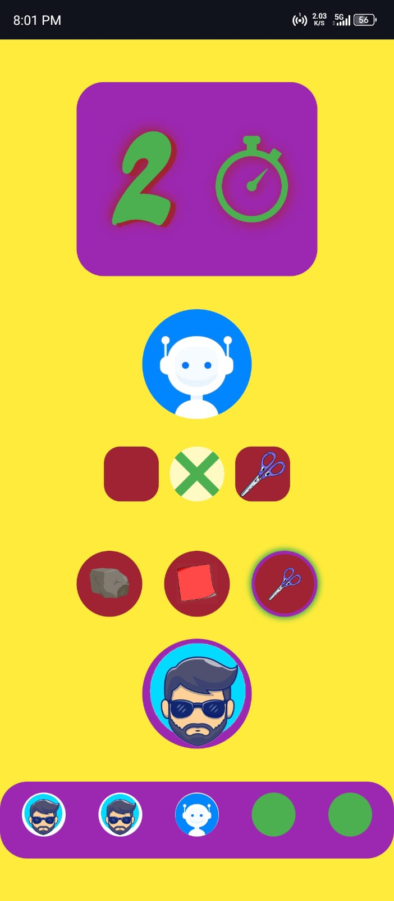
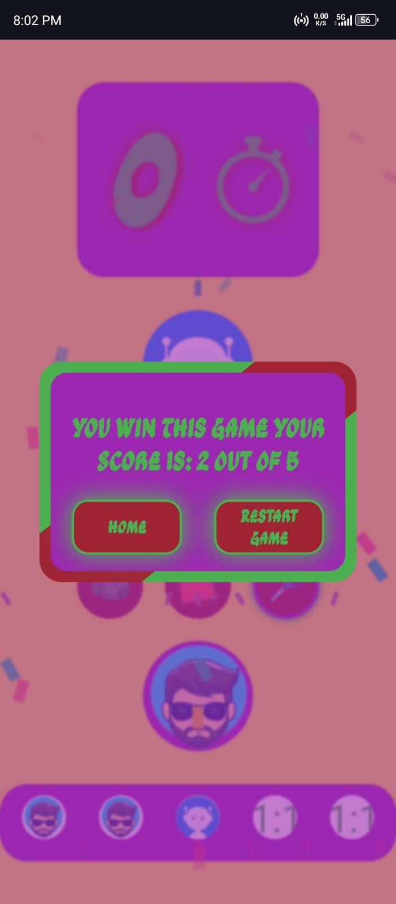

# Stone-Paper-Sciccor
Stone Paper Scissors Game

Game Description

Play the classic Stone Paper Scissors game against the computer. Choose between stone, paper, or scissors and try to win!

How to Play

1. Choose stone, paper, or scissors.
2. The computer will make its move.
3. Win by defeating the computer:
    - Stone beats scissors.
    - Scissors beats paper.
    - Paper beats stone.

Features

- Single-player mode against the computer
- Score tracking
- Simple and intuitive interface

Requirements

- Web browser
- Internet connection

Acknowledgments

- I would like to acknowledge my own dedication and perseverance in creating this Stone Paper Scissors game as a personal project. I am proud to have taken on this challenge and seen it through to completion, learning and growing as a developer along the way. This project has been a valuable opportunity for me to practice and improve my skills, and I am grateful for the experience.

Screenshots

Here is some screenshot

Home Page: Select Round.
  
  

How To Play: All Tips And Guidance.
  
  

  

    
    
Game Dashboard: Also Responsive For Phone.

  

        
  

    
    
Final Result: Your Final Result With Score.

  

